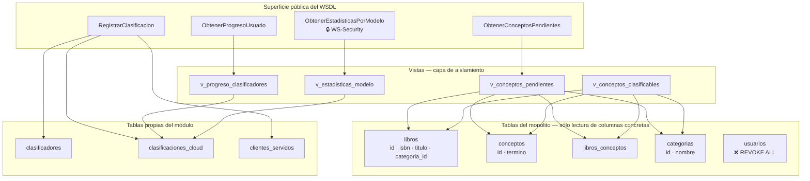

# Auditoría del contrato WSDL — Tarea 3

El WSDL es una **superficie pública**: cualquiera que alcance el puerto puede
descargarlo y leer exactamente qué sabe hacer el sistema. Esta auditoría revisa
operación por operación qué columnas del monolito se exponen, cuáles se
transforman y cuáles se ocultan a propósito.

La regla de ingeniería es: *el contrato expone capacidades y datos necesarios,
no la estructura completa de la base de datos.*

## 1. Dato → operación → exposición → justificación

| Dato (origen real) | Operación | ¿Se expone? | Justificación |
|---|---|---|---|
| `libros.isbn` | Pendientes, Registrar | **Sí, tal cual** | Es la clave del contrato. Clave candidata natural, con significado fuera del sistema |
| `libros.titulo` | Pendientes, Registrar | **Sí, tal cual** | El clasificador necesita saber de qué libro habla el concepto |
| `libros.id` | — | **No** | `SERIAL` interno. Exponerlo filtraría el diseño físico y el volumen del catálogo |
| `libros.precio`, `stock` | — | **No** | Datos comerciales, ajenos a clasificar conceptos |
| `libros.sinopsis` | — | **No** | No aporta a la decisión de clasificación |
| `libros.creado_en`, `actualizado_en` | — | **No** | Auditoría interna del monolito |
| `conceptos.termino` | Pendientes, Registrar | **Sí, tal cual** | Es lo que se clasifica |
| `conceptos.id` | Pendientes, Registrar | **Sí, como `conceptoId`** | Necesario para referirse a un concepto sin ambigüedad. Es un id de catálogo, no de una fila sensible |
| `libros_conceptos.definicion` | Pendientes | **Sí, tal cual** | Sin la definición, el clasificador no puede decidir el modelo |
| `libros_conceptos.capitulo`, `pagina` | Pendientes | **Sí, opcional** | Contexto útil; su ausencia no rompe nada |
| `categorias.nombre` | Pendientes | **Sí, como `categoria`** | El enunciado lo pide: información del libro y su categoría |
| `categorias.id` | — | **No** | El cliente no necesita filtrar por id |
| `usuarios.*` | — | **No, y sin permiso** | Otra autoridad. El rol tiene `REVOKE ALL` sobre la tabla |
| `clasificadores.id` | — | **No** | El correo es la clave del contrato |
| `clasificadores.correo` | Progreso, Registrar | **Sí, tal cual** | Identifica al clasificador entre sesiones |
| `clasificaciones_cloud.id` | Registrar | **Sí, como `clasificacionId`** | Acuse de recibo verificable en la base |
| `clasificaciones_cloud.clasificado_en` | Registrar | **Sí, como `registradoEn`** | El cliente muestra cuándo quedó registrado |
| `clasificaciones_cloud.cliente_servido_id` | — | **No** | Telemetría interna |
| `clientes_servidos.peticiones_atendidas` | Registrar | **Sí, transformado** | Se devuelve el contador **de ese cliente**, no la tabla completa |
| `clientes_servidos.*` (resto) | — | **No** | Telemetría de operación |
| Credenciales de BD, cadena de conexión | — | **No** | Información sensible interna |
| Mensajes de PostgreSQL | — | **No** | Revelarían nombres de tabla y columna |

**Transformaciones deliberadas:**

- `nombre` + `apellidos` se devuelven concatenados en `ObtenerProgresoUsuario`:
  el cliente muestra una etiqueta, no necesita los campos por separado.
- El conteo de pendientes se **calcula**, no se expone como consulta: el cliente
  recibe un número, no la forma de obtenerlo.
- `peticionesAtendidas` es el contador del cliente que llama, aislado del resto.

## 2. Diagrama del contrato

Ninguna operación llega a `usuarios`, y no por disciplina del código: el rol de
base de datos no tiene el permiso.

## 3. Riesgos identificados y su mitigación

### Riesgo 1 — El WSDL revela el modelo de negocio y ayuda a sondear

**Qué pasa:** cualquiera que descargue `/soap?wsdl` conoce las cuatro
operaciones, los tipos exactos, los nombres de campo y el patrón de ISBN. Con
eso puede construir peticiones válidas sin adivinar y enumerar el catálogo.

**Gravedad:** media. Es información de negocio, no credenciales.

**Mitigación:** (a) `ObtenerConceptosPendientes` tiene techo de 200 por llamada,
así que enumerar cuesta muchas peticiones; (b) el contrato no expone precio,
stock ni sinopsis, de modo que el catálogo comercial no se puede reconstruir;
(c) el WSDL puede servirse sólo a la red interna de la VM mientras el endpoint
queda abierto. **Pendiente:** hoy el WSDL es público; restringirlo es una
decisión de despliegue, no de código.

### Riesgo 2 — Las operaciones de escritura no están autenticadas

**Qué pasa:** `RegistrarClasificacion` acepta cualquier correo. Nada impide que
alguien registre clasificaciones a nombre de otra persona o llene la tabla.

**Gravedad:** alta para la integridad de los datos.

**Mitigación actual:** la restricción `UNIQUE` limita el daño a una fila por
concepto y clasificador; el rol no tiene `DELETE`, así que no se puede borrar
evidencia. **Insuficiente por sí sola.** Lo correcto es extender el
`UsernameToken` a `RegistrarClasificacion`, con una credencial por clasificador
en lugar de un secreto compartido. Se dejó fuera porque el enunciado pide
proteger *una* operación sensible y la GUI captura la identidad libremente; es
la primera cosa que cambiaría en una versión real.

### Riesgo 3 — Acoplamiento por base de datos compartida

**Qué pasa:** el módulo depende de que `libros.isbn`, `conceptos.termino` y
`libros_conceptos` existan con esos nombres. Si el monolito los renombra, este
servicio se cae sin que nadie haya tocado su código, y la clave foránea compuesta
puede bloquear un `ALTER` del monolito.

**Gravedad:** media, y crece con el tiempo.

**Mitigación:** el módulo lee de **vistas** propias, así que un renombre se
absorbe cambiando la vista; los permisos son por columna, de modo que un cambio
en ellas falla ruidosamente al reaplicar los `GRANT` en vez de en silencio. La
solución de fondo —que el monolito publique su propio contrato— está fuera del
alcance de este ejercicio.

### Riesgo 4 — El secreto de WS-Security es compartido y está en claro en el `.env`

**Qué pasa:** PasswordDigest exige que el servidor conozca el secreto. Un solo
secreto para todos los consumidores de la operación protegida: rotarlo obliga a
avisar a todos, y quien tenga acceso al `.env` de la VM lo tiene.

**Gravedad:** media.

**Mitigación:** el `.env` no se versiona y sus permisos deben ser `600`; la
ventana de frescura y el rechazo de nonces repetidos limitan qué se puede hacer
con un sobre capturado. Con TLS, lo correcto sería `PasswordText` + bcrypt en
base de datos, que sí permite una credencial por consumidor.

## 4. Conclusión sobre contrato estricto y mantenibilidad

Un contrato estricto **cuesta al cambiar y ahorra al integrar**.

Cuesta: agregar un campo obligatorio a `RegistrarClasificacion` rompe a todos los
clientes generados, porque su stub valida contra el XSD viejo. Por eso todo campo
nuevo debe entrar como `minOccurs="0"`, y un cambio incompatible obliga a
publicar una segunda versión del contrato y sostener las dos.

Ahorra: el cliente de la Tarea 4 se escribió sin ver una línea del servidor, y
rechazó un modelo inválido antes de gastar una llamada de red. Ese contrato
también encontró un error mío en el `binding` que las pruebas manuales no veían.

Para este sistema el balance es favorable: los consumidores son aplicaciones de
escritorio distribuidas, difíciles de actualizar en bloque, que es exactamente el
escenario donde un contrato verificable por máquina paga su costo.
