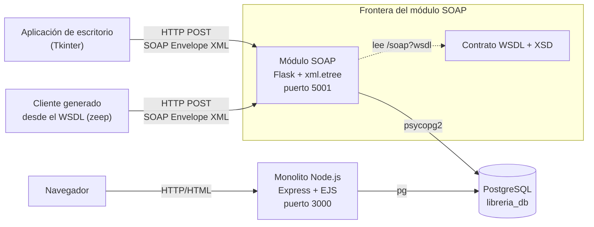
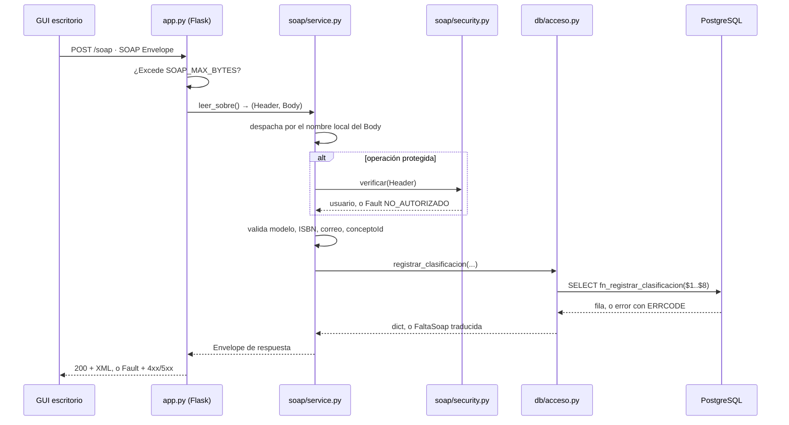
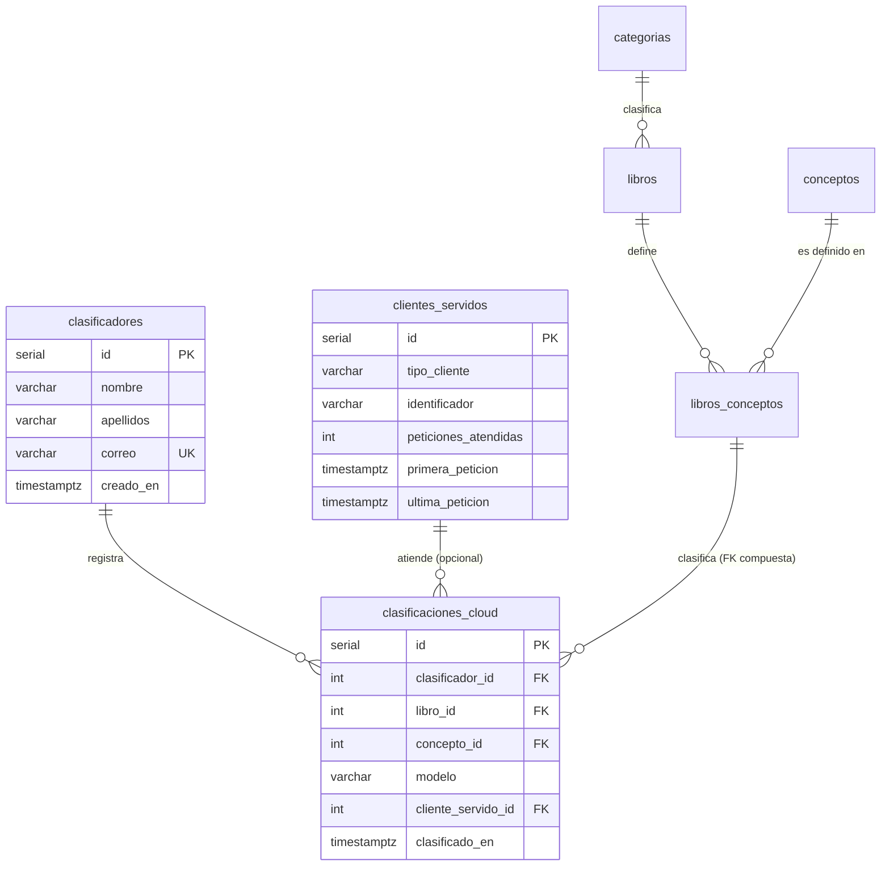

# Documentación técnica — Módulo SOAP de clasificación Cloud

Ejercicio 03. Universidad de Monterrey, Integración de Aplicaciones
Computacionales.

---

## 1. Objetivo y alcance

Construir un módulo SOAP **independiente** que se integre con el monolito de
librería (Node.js + Express + EJS + PostgreSQL) sin modificar una sola línea de
su código ni la estructura de sus tablas, y que permita clasificar los conceptos
del catálogo real en modelos de servicio en la nube.

### Dentro del alcance

- Consultar conceptos pendientes del catálogo real.
- Registrar clasificaciones IaaS, PaaS, SaaS y FaaS.
- Consultar el progreso de clasificación de un usuario.
- Registrar clasificadores y contabilizar peticiones por cliente de escritorio.
- Detectar clasificaciones duplicadas y responder con SOAP Fault de conflicto.
- Estadísticas por modelo, protegidas con WS-Security (Tarea 1).
- Mantener el monolito funcionando sin cambios.

### Fuera del alcance

Migrar el monolito, crear una API REST, reemplazar PostgreSQL, modificar el
esquema funcional existente, y usar Spyne o Zeep **del lado del servidor** para
ocultar la construcción del Envelope.

---

## 2. Sistema existente y qué necesita el módulo

El enunciado nombra las tablas en inglés; en esta base están en español, que es
la convención del proyecto. La correspondencia es:

| Enunciado | Tabla real | Qué necesita el módulo |
|---|---|---|
| `books` | `libros` | `id`, `isbn`, `titulo`, `categoria_id` — sólo lectura |
| `concepts` | `conceptos` | `id`, `termino` — sólo lectura |
| `book_concepts` | `libros_conceptos` | `libro_id`, `concepto_id`, `definicion`, `capitulo`, `pagina` — sólo lectura |
| `categories` | `categorias` | `id`, `nombre` — sólo lectura |
| `users` | `usuarios` | **Nada.** Ni `SELECT` |

Claves y restricciones relevantes que el módulo aprovecha:

- `libros.isbn` tiene `UNIQUE`: es una clave candidata natural, y por eso el
  contrato identifica los libros por ISBN y nunca por el `id` interno.
- `libros_conceptos` tiene PK compuesta `(libro_id, concepto_id)`. Eso permite
  una **clave foránea compuesta** desde `clasificaciones_cloud`, de modo que la
  base garantiza que el concepto esté realmente definido en ese libro.
- La definición de un concepto pertenece al par (libro, concepto), no al
  término: el mismo "Bucket" se define distinto en dos libros. El módulo respeta
  esa semántica y siempre reporta la definición junto con su libro.

Datos generados por el módulo: los tres nuevos (clasificadores,
clasificaciones_cloud, clientes_servidos). Datos de sólo lectura: todo lo demás.

---

## 3. Macro-arquitectura



**Fronteras y propiedad de cada responsabilidad:**

| Componente | Dueño de | Protocolo con el vecino |
|---|---|---|
| Aplicación de escritorio | La experiencia del clasificador | SOAP/HTTP hacia el módulo. **No conoce PostgreSQL** |
| Módulo SOAP | El contrato, la validación, sus tres tablas | SQL parametrizado hacia PostgreSQL, con rol propio |
| Monolito Node.js | El catálogo y los usuarios de la librería | SQL hacia PostgreSQL, con su propio rol |
| PostgreSQL | La integridad de los datos | — |

Los dos procesos llegan a la misma base **por caminos separados y con
privilegios distintos**. Ese es el punto de acoplamiento del diseño y está
analizado en la sección 12.

---

## 4. Organización del código

```
library_soap_service/
├── app.py                 Flask sin Blueprints. Sólo traduce HTTP ↔ SOAP
├── config/ajustes.py      Único lector de variables de entorno
├── db/acceso.py           Todo el SQL
├── soap/
│   ├── envelope.py        Envelope, Header, Body con xml.etree
│   ├── service.py         Despacho, validación, respuestas
│   ├── faults.py          Vocabulario de errores → SOAP Fault
│   └── security.py        WS-Security UsernameToken / PasswordDigest
├── wsdl/library-classifier.wsdl
├── sql/soap_module.sql
├── cliente/cliente_escritorio.py
└── tests/
```

El patrón es **capas con dependencia en un solo sentido**:
`app.py → soap/service.py → db/acceso.py`. Ninguna capa de abajo importa a una
de arriba. `app.py` no sabe qué operaciones existen; `service.py` no sabe qué
motor de base de datos hay; `acceso.py` no sabe que existe HTTP ni XML.

La única excepción deliberada: `db/acceso.py` importa las excepciones de
`soap/faults.py`. Se eligió tener **un solo vocabulario de errores** en todo el
módulo en lugar de una jerarquía de excepciones por capa que habría que traducir
dos veces. Es un acoplamiento de tipos, no de comportamiento.

---

## 5. Contrato WSDL y tipos XSD

`wsdl/library-classifier.wsdl`, WSDL 1.1, estilo **document/literal wrapped**.
El namespace del servicio es `http://udem.edu/iac/libreria/clasificador`.

### Tipos simples con restricción

| Tipo | Restricción | Qué evita |
|---|---|---|
| `ModeloCloud` | Enumeración `IaaS`, `PaaS`, `SaaS`, `FaaS` | Que llegue "XaaS" o "iaas" |
| `Isbn` | Patrón `[0-9\-]{10,16}[0-9X]`, máx. 17 | ISBN inventados o rutas disfrazadas |
| `Correo` | Patrón de correo, máx. 150 | Correos mal formados |
| `NombrePersona` | 1 a 120 caracteres | Nombres vacíos |

El tipado no es decorativo: en la Tarea 4, el stub de `zeep` rechazó
`modelo="XaaS"` **antes de salir a la red**, con el mismo criterio que aplica el
servidor. Un contrato sin tipos habría gastado una llamada para descubrirlo.

### Operaciones

| Operación | Entrada | Salida |
|---|---|---|
| `ObtenerConceptosPendientes` | `correo?`, `limite?` | `total`, `concepto*` con término, definición, ISBN, libro y categoría |
| `RegistrarClasificacion` | `clasificador{nombre, apellidos, correo}`, `conceptoId`, `isbn`, `modelo`, `cliente?` | `clasificacionId`, `termino`, `libro`, `modelo`, `registradoEn`, `peticionesAtendidas` |
| `ObtenerProgresoUsuario` | `correo` | `totalClasificados`, `totalPendientes`, `porModelo*` |
| `ObtenerEstadisticasPorModelo` | — (+ `wsse:Security`) | `generadoEn`, `estadistica*` |

El `soap:address` se reescribe en tiempo de ejecución con el host real de la
petición, para que el WSDL publicado desde la VM apunte a la VM sin editar el
archivo en cada despliegue.

---

## 6. Flujo de una petición



---

## 7. Persistencia, transacciones y permisos

### Tablas propias



Restricciones y por qué existen:

| Restricción | Qué garantiza |
|---|---|
| `uq_clasificacion_no_repetida (clasificador_id, concepto_id)` | La regla que pide el enunciado. Produce el Fault de conflicto 409 |
| `fk_cc_libro_concepto (libro_id, concepto_id)` → `libros_conceptos` | Que el concepto **esté definido en ese libro**, no sólo que ambos existan |
| `ck_clasificaciones_modelo` | Sólo los cuatro modelos, aunque alguien escriba directo en `psql` |
| `ON DELETE CASCADE` hacia `libros_conceptos` | Si el bibliotecario borra el libro o le quita el concepto, la clasificación se va con él. Ver el problema 6 |
| `ON DELETE RESTRICT` hacia `clasificadores` | Tabla del módulo: la restricción no acopla a nadie de fuera |
| `ON DELETE SET NULL` hacia `clientes_servidos` | La telemetría se puede depurar sin perder clasificaciones |
| `uq_clientes_servidos (tipo_cliente, identificador)` | Un binario en dos máquinas son dos clientes |

### Transacción

`RegistrarClasificacion` toca tres tablas. Hacerlo en tres viajes desde Python
deja ventanas en las que el contador de peticiones ya subió pero la
clasificación falló. Por eso vive en `fn_registrar_clasificacion`: **una llamada,
una transacción**. La duplicidad se detecta con la restricción `UNIQUE`, no con
un `SELECT` previo — entre el `SELECT` y el `INSERT` cabe otra petición
concurrente.

### Mínimo privilegio

El módulo usa el rol `libreria_soap`, no `postgres` ni `libreria_app`.

| Objeto | Permiso | Por qué |
|---|---|---|
| `libros (id, isbn, titulo, categoria_id)` | `SELECT` de columna | Sólo lo que el contrato expone |
| `conceptos (id, termino)` | `SELECT` de columna | |
| `libros_conceptos (libro_id, concepto_id, definicion, capitulo, pagina)` | `SELECT` de columna | |
| `categorias (id, nombre)` | `SELECT` de columna | |
| `usuarios` | **`REVOKE ALL`** | Ni `SELECT`. Aunque hubiera inyección SQL, `password_hash` es inalcanzable |
| `clasificadores`, `clasificaciones_cloud`, `clientes_servidos` | `SELECT`, `INSERT`, `UPDATE` | Sin `DELETE`: se corrige con otra fila, no borrando |
| Vistas del módulo | `SELECT` | |
| `fn_registrar_clasificacion` | `EXECUTE` | |

Verificado: la corrida local de las 18 pruebas se hizo **conectando con
`libreria_soap`**, no con un superusuario. Si faltara un `GRANT`, habrían
fallado.

---

## 8. Seguridad

### WS-Security (Tarea 1)

`ObtenerEstadisticasPorModelo` exige `wsse:UsernameToken` con **PasswordDigest**:

```
Password = Base64( SHA1( Nonce + Created + secreto ) )
```

- Con `PasswordText` el secreto viaja en claro dentro del sobre y queda en
  cualquier log de proxy. Con digest no viaja nunca.
- Se rechaza el token si `Created` cae fuera de la ventana (300 s por defecto) o
  si el `Nonce` ya se usó: eso cierra el reenvío de un sobre capturado (prueba
  N11).
- La comparación de usuario y de digest usa `hmac.compare_digest`, en tiempo
  constante.
- Nunca se dice **cuál** comprobación falló: distinguir "usuario incorrecto" de
  "contraseña incorrecta" le regala medio trabajo a quien prueba credenciales.

**Contrapartida honesta:** PasswordDigest obliga al servidor a conocer el
secreto en claro para recalcular el digest, así que no se puede guardar con
bcrypt. Vive sólo en el `.env` de la VM: fuera del repositorio, fuera de la base
y fuera del WSDL. Con TLS delante, lo correcto sería `PasswordText` + bcrypt.

### Otras defensas

- Límite de tamaño del sobre antes de analizarlo (`SOAP_MAX_BYTES`).
- Todo valor de usuario viaja como parámetro `%s`. No hay una sola concatenación
  de SQL en el módulo.
- Todo XML de salida se construye con `ElementTree`, que escapa. No hay una sola
  concatenación de XML.
- El despacho usa el nombre del elemento del `Body`, **no** la cabecera
  `SOAPAction`: confiar en ella permitiría pedir una operación distinta de la que
  trae el cuerpo.

---

## 9. Validación y SOAP Fault

La validación se repite en el servidor aunque el XSD ya la exprese: el XSD lo
aplica el cliente **si quiere**, y el servidor no puede suponer que alguien
validó por él.

| Código de Fault | Tipo | HTTP | Caso |
|---|---|---|---|
| `XML_INVALIDO` | Client | 400 | El sobre no se puede analizar |
| `OPERACION_DESCONOCIDA` | Client | 400 | El Body pide algo fuera del contrato |
| `DATO_INVALIDO` | Client | 400 | Campo faltante o mal formado |
| `MODELO_INVALIDO` | Client | 400 | Modelo distinto de los cuatro |
| `CONCEPTO_INEXISTENTE` | Client | 404 | El concepto no está definido en ese libro |
| `LIBRO_INEXISTENTE` | Client | 404 | ISBN que no existe |
| `CLASIFICADOR_INEXISTENTE` | Client | 404 | Correo sin clasificaciones |
| `CLASIFICACION_DUPLICADA` | Client | **409** | Mismo clasificador, mismo concepto |
| `NO_AUTORIZADO` | Client | 401 | WS-Security ausente, inválido o reenviado |
| `ERROR_SERVIDOR` | Server | 500 | Cualquier fallo nuestro |

`faultcode` distingue `soap:Client` de `soap:Server`, que es lo que le dice al
cliente si reintentar tiene sentido. El `<codigo>` del detalle es **estable** y
es lo que el cliente programa; el `<mensaje>` es para mostrar a una persona y
puede cambiar sin romper a nadie.

**SOAP 1.1 contempla sólo HTTP 500 para los Fault.** Aquí se devuelve además el
código semántico (400/401/404/409) porque le da a un cliente HTTP la misma
información sin abrir el sobre, y las bibliotecas SOAP siguen encontrando el
Fault en el cuerpo: verificado con `zeep`, que lo interpreta correctamente.

Lo que **nunca** sale al cliente: trazas, SQL, nombres de tabla, rutas,
credenciales. El detalle técnico se registra en el log del servidor
(`detalle_interno`), donde el cliente no llega.

---

## 10. Despliegue y configuración

| Variable | Para qué | Riesgo si se descuida |
|---|---|---|
| `DB_*` | Conexión con el rol `libreria_soap` | Usar `postgres` anula el mínimo privilegio |
| `SOAP_HOST` / `SOAP_PORT` | Dónde escucha (5001) | `0.0.0.0` sin firewall expone el servicio |
| `WSSE_USUARIO` / `WSSE_SECRETO` | Credenciales de la operación protegida | Sin ellas, la operación se cierra (no se abre) |
| `WSSE_VENTANA_SEGUNDOS` | Frescura del token | Ventana grande = más margen de reenvío |
| `SOAP_MAX_BYTES` | Tamaño máximo del sobre | Sin límite, un XML gigante tumba el proceso |

`app.py` avisa en el log al arrancar si falta algo. El servidor de desarrollo de
Flask **no** es para producción: en la VM debe ir detrás de Gunicorn o del proxy
inverso que ya publica el monolito.

---

## 11. Rendimiento

- Pool de conexiones (`ThreadedConnectionPool`), no una conexión por petición.
- Las consultas de lectura salen de vistas, definidas una sola vez.
- Índices en `clasificaciones_cloud` por clasificador, concepto y modelo.
- `ObtenerConceptosPendientes` tiene límite por defecto (50) y techo (200): sin
  ellos, un cliente podría pedir el catálogo completo en cada arranque.
- Medido en la Tarea 5: **~85 % de cada sobre es estructura XML**, no datos. Es
  el costo real de SOAP y es el número con el que se comparará contra REST.

---

## 12. Mantenibilidad, interoperabilidad y escalabilidad

**Interoperabilidad demostrada:** un cliente `zeep` generado sólo a partir del
WSDL consumió las cuatro operaciones, incluida la protegida, sin ver el código
del servidor. Ese ejercicio encontró un defecto real del contrato (sección 14).

**El riesgo estructural del diseño** es compartir la base con el monolito. Si el
monolito renombrara `libros.isbn`, este módulo dejaría de funcionar sin que nadie
hubiera tocado su código. Mitigaciones, de menor a mayor costo:

1. Leer sólo de **vistas** del módulo (ya se hace): el renombre se absorbe
   cambiando la vista, no el código Python.
2. Permisos de columna: el módulo declara explícitamente qué columnas usa, así
   que un cambio en ellas falla ruidosamente al aplicar el `GRANT`, no en
   silencio en producción.
3. A futuro: que el monolito publique un contrato propio y el módulo deje de
   tocar sus tablas. Fuera del alcance de este ejercicio.

**Escalabilidad:** el estado del servicio es la caché de nonces de WS-Security,
que vive en memoria del proceso. Con un solo worker es correcto; con varios,
no — y no es teórico. Corriendo la misma suite bajo Gunicorn:

| Configuración | Prueba N11 (reenvío del mismo token) |
|---|---|
| `--workers 1 --threads 8` | `NO_AUTORIZADO` / HTTP 401 — rechazado |
| `--workers 4` | **HTTP 200 — aceptado** |

Con cuatro procesos, el sobre que un worker ya rechazó lo acepta otro, y la
protección contra reenvíos desaparece sin que nada avise. Por eso
`deploy/libreria-soap.service` fija un worker y resuelve la concurrencia con
hilos, que comparten esa memoria. Para escalar a varios procesos hay que mover
la caché a Redis o a una tabla antes, no después.

### El problema 7, en detalle: SELinux y el despliegue

La unidad no arrancó a la primera. Falló 41 veces en bucle con `203/EXEC` y
`Permission denied`, **aunque el binario existía y corría a mano**.

La primera hipótesis fue que el binario de Gunicorn del entorno virtual llevaba
la etiqueta `user_home_t`, que systemd no puede ejecutar, y que bastaría con
apuntar el `ExecStart` a `python3 -m gunicorn`, porque `.venv/bin/python3` es un
enlace a `/usr/bin/python3` y para la comprobación contaría el contexto del
destino. **Siguió fallando igual.** La causa real estaba en el registro de
auditoría:

```
avc:  denied  { read } for  pid=4868 comm="(python3)" name="python3"
      scontext=system_u:system_r:init_t:s0
      tcontext=unconfined_u:object_r:user_home_t:s0
      tclass=lnk_file  permissive=0
```

`tclass=lnk_file`: la denegación es sobre **leer el enlace simbólico**, no sobre
ejecutar su destino. systemd tiene que leerlo para resolverlo, y el fallo ocurre
un paso antes de llegar al destino — así que ningún `ExecStart` lo evita.

Todo el árbol estaba mal etiquetado: los archivos llevaban la etiqueta de un
directorio personal aunque vivieran en `/opt`. Pasa al clonar en `~` y mover con
`mv`, que conserva las etiquetas. La solución no fue una regla nueva de SELinux
sino devolverle a cada archivo el contexto que le corresponde por su ubicación:

```bash
sudo restorecon -Rv /opt/udem/libreria/services/library_soap_service
```

Bajo `/opt` la política define `usr_t`, que systemd sí puede leer y ejecutar. Es
idempotente y hay que repetirlo si se recrea el entorno virtual, así que quedó
documentado como **paso obligatorio del despliegue** en la unidad y en el README.

---

## 13. Decisiones de ingeniería

Formato: **Necesidad → Decisión → Justificación → Ventajas → Limitaciones**.

### 13.1 Flask + Python para el módulo

- **Necesidad:** un componente independiente del monolito Node.js, que corra en
  la misma VM y hable con la misma base.
- **Decisión:** Flask con `psycopg2`, en un proceso y un puerto propios.
- **Justificación:** Flask no impone estructura, que es lo que se necesita
  cuando el protocolo (SOAP) ya la impone. `psycopg2` es el driver de referencia
  y permite consultas parametrizadas y control explícito de transacciones.
- **Ventajas:** despliegue independiente; el monolito no se toca; el fallo de un
  componente no arrastra al otro.
- **Limitaciones:** dos runtimes que mantener en la misma VM; el servidor de
  desarrollo de Flask no sirve para producción.

### 13.2 SOAP en lugar de REST

- **Necesidad:** que clientes de escritorio, posiblemente en otros lenguajes,
  consuman el servicio con garantías de tipo.
- **Decisión:** SOAP 1.1 document/literal con contrato WSDL.
- **Justificación:** el contrato es verificable por máquina; el cliente genera
  sus stubs y valida antes de llamar; los errores son parte del contrato (Fault),
  no una convención de códigos HTTP.
- **Ventajas:** interoperabilidad demostrable; tipado fuerte; errores tipificados.
- **Limitaciones:** ~85 % del tráfico es estructura; más verboso de depurar;
  cualquier cambio obliga a versionar el contrato.

### 13.3 Construir el Envelope a mano con `xml.etree`

- **Necesidad:** entender qué hace un stack SOAP, no sólo usarlo (lo exige el
  enunciado).
- **Decisión:** `xml.etree.ElementTree` para leer y construir; sin Spyne ni Zeep
  en el servidor.
- **Justificación:** obliga a distinguir Envelope, Header y Body y a manejar
  namespaces explícitamente. `ElementTree` escapa los valores, así que no hay
  riesgo de inyección de XML.
- **Ventajas:** cero dependencias de SOAP en el servidor; control total del
  Fault; se ve dónde está el trabajo real.
- **Limitaciones:** el servidor **no valida contra el XSD** (lo valida a mano);
  cada operación nueva se escribe a mano. Un stack generador lo haría solo.

### 13.4 Identificar por ISBN, no por `id` interno

- **Necesidad:** exponer libros sin exponer la estructura interna.
- **Decisión:** el contrato usa `isbn`; el `id` no sale ni entra nunca.
- **Justificación:** el ISBN es clave candidata natural con `UNIQUE` y tiene
  significado fuera del sistema. El `id` es un `SERIAL`, un detalle de
  implementación.
- **Ventajas:** el contrato no filtra el diseño físico; el cliente usa un
  identificador que ya conoce.
- **Limitaciones:** una consulta extra para resolver ISBN → id; un ISBN mal
  capturado en el catálogo rompe la referencia.

### 13.5 Tablas propias, no reutilizar `usuarios`

- **Necesidad:** identificar al clasificador sin mezclar autoridades.
- **Decisión:** tabla `clasificadores`, con `REVOKE ALL` sobre `usuarios`.
- **Justificación:** son identidades de sistemas distintos, con distinto ciclo de
  vida. Reutilizar `usuarios` acoplaría el login del monolito al del módulo.
- **Ventajas:** frontera nítida; el módulo no puede leer contraseñas ni por
  accidente.
- **Limitaciones:** una persona con cuenta en el monolito se vuelve a capturar
  aquí; los datos de identidad quedan duplicados.

### 13.6 Un procedimiento almacenado para el registro

- **Necesidad:** escribir en tres tablas sin dejar estados a medias.
- **Decisión:** `fn_registrar_clasificacion` en PL/pgSQL, invocado una vez.
- **Justificación:** una sola transacción del lado del servidor, un solo viaje de
  red, y la lógica de integridad junto a los datos que protege.
- **Ventajas:** atomicidad garantizada; menos latencia; errores tipificados con
  `ERRCODE`.
- **Limitaciones:** lógica repartida entre Python y SQL; versionarla exige un
  script en `db/pending/`; más difícil de depurar que código Python.

### 13.7 WS-Security con PasswordDigest

- **Necesidad:** proteger una operación sensible sin sesión ni cookies.
- **Decisión:** `UsernameToken` con digest, ventana de frescura y anti-replay.
- **Justificación:** es el perfil OASIS estándar; lo hablan zeep, wsimport y
  svcutil sin código a medida.
- **Ventajas:** el secreto no viaja; interoperable; verificado contra zeep.
- **Limitaciones:** el servidor necesita el secreto en claro, así que no puede
  hashearlo; la caché de nonces es de un solo proceso; sin TLS el sobre sigue
  siendo legible aunque la contraseña no lo sea.

### 13.8 Códigos HTTP semánticos junto al Fault

- **Necesidad:** que el cliente distinga error de entrada, conflicto y fallo
  interno.
- **Decisión:** Fault SOAP siempre, y HTTP 400/401/404/409/500 según el caso.
- **Justificación:** SOAP 1.1 sólo prevé 500, pero ningún cliente se rompe por un
  4xx con Fault en el cuerpo, y el enunciado pide asociar la duplicidad a 409.
- **Ventajas:** legible desde `curl` y desde un proxy; verificado con zeep.
- **Limitaciones:** se aparta de la letra de SOAP 1.1; un cliente muy estricto
  podría no buscar el Fault en un 4xx.

### 13.9 Faults sin detalle técnico

- **Necesidad:** que el cliente entienda el error sin regalarle información a un
  atacante.
- **Decisión:** código estable + mensaje humano; el detalle va sólo al log.
- **Justificación:** un mensaje de PostgreSQL revela nombres de tabla y columna,
  que es exactamente el mapa que busca quien está sondeando.
- **Ventajas:** superficie de información mínima; mensajes traducibles en la GUI.
- **Limitaciones:** depurar en producción exige acceso al log del servidor.

---

## 14. Problemas encontrados y cómo se resolvieron

| # | Problema | Cómo se detectó | Solución |
|---|---|---|---|
| 1 | El WSDL no era XML válido | `xmllint` | Los separadores `<!-- ---- -->` incluían `--`, prohibido dentro de un comentario XML. Se sustituyeron por `=` |
| 2 | El WSDL servido perdía `xmlns:tns` y quedaba inservible | Comparar el archivo con lo que servía el endpoint | `ElementTree` sólo conserva las declaraciones de namespace usadas en **nombres**; en un WSDL los prefijos viven en **valores de atributo**. Se cambió a sustitución textual sólo de `location` |
| 3 | `zeep` fallaba con "el Body debe contener una operación" | Cliente de la Tarea 4 | El `binding` declaraba `<soap:header part="parameters">` en la operación protegida, lo que movía el cuerpo al encabezado. WS-Security no se declara así: se eliminó |
| 4 | `psycopg2-binary==2.9.9` no compila en Python 3.13 | `pip install` | No publica rueda para 3.13. Fijado a 2.9.10 |
| 5 | `zeep==4.2.1` no importa en Python 3.13 | `import zeep` | Usa el módulo `cgi`, retirado en 3.13. Fijado a 4.3.x |
| 7 | La unidad de systemd fallaba con `203/EXEC`, 41 veces en bucle | Instalarla en la VM, y después `ausearch -m avc` | El árbol estaba etiquetado `user_home_t` aunque viva en `/opt`. Resuelto con `restorecon`. Ver abajo |
| 6 | **El módulo rompía el monolito**: no se podía borrar un libro cuyo concepto hubiera sido clasificado | Prueba de regresión de las operaciones del monolito, ya con el módulo instalado en la VM | La FK compuesta era `ON DELETE RESTRICT`. Se cambió a `CASCADE`: ver abajo |

El problema 3 es el más interesante técnicamente: **el cliente manual no lo
detectaba** porque construye el sobre a mano y nunca lee el binding. Sólo
apareció al consumir el contrato con otro stack. Es el argumento práctico de por
qué la Tarea 4 existe.

El problema 6 es el más importante de todos, porque incumplía un criterio de
finalización. Instalado el módulo, esto dejaba de funcionar en el monolito:

```
ERROR: update or delete on table "libros_conceptos" violates foreign key
       constraint "fk_cc_libro_concepto" on table "clasificaciones_cloud"
```

La restricción se había justificado como protección del registro de auditoría.
El efecto real era otro: **un componente nuevo bloqueándole al sistema existente
una operación suya**. El bibliotecario ya no podía borrar un libro porque alguien
había clasificado uno de sus conceptos.

La decisión se revirtió a propósito. El módulo SOAP no es el sistema de registro
del catálogo; el monolito sí. Perder una clasificación cuando desaparece el libro
al que se refiere es preferible a secuestrarle una operación a su dueño. Se
conserva la mitad valiosa de la restricción: la clave foránea compuesta sigue
obligando a que el concepto **esté definido en ese libro** al registrarlo.

No lo detectó ninguna de las 18 pruebas, porque todas ejercitan el módulo y
ninguna ejercita al vecino. Un módulo que se integra con un sistema existente
necesita pruebas del sistema existente, no sólo de sí mismo.
